

# Gain and Offset Calibration of the Analog Signal Conditioning (OPAMP) Peripheral

	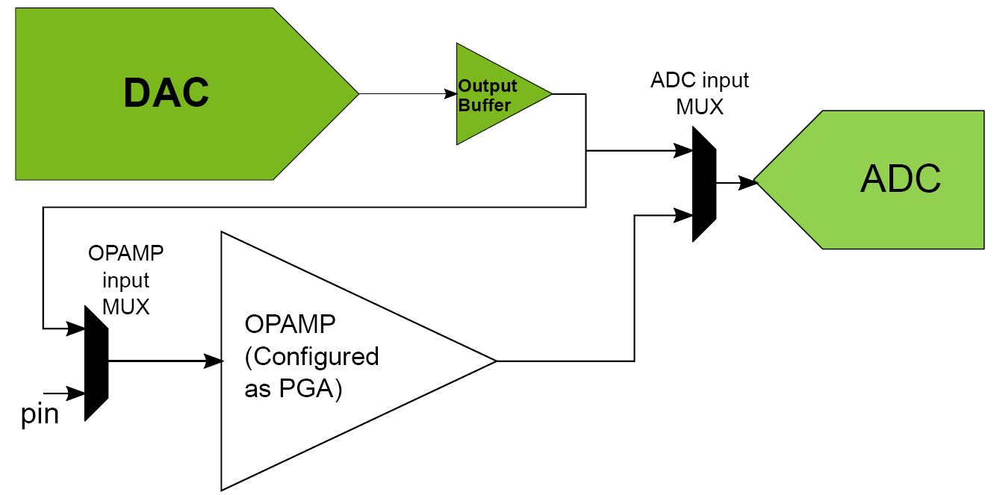

A new feature introduced in the AVR® DB MCU is the Analog Signal Conditioning (OPAMP) peripheral. In this example, the OPAMP is configured as a Programmable Gain Amplifier (PGA). The internal Digital to Analog Converter (DAC) and the internal Analog to Digital Converter (ADC) are used to calibrate the gain and offset for the PGA. For more information on the calibration procedure, see the [application note](https://microchip.com/DS00003633).   

## Related Documentation

* [AN3633 - Gain and Offset Calibration of the Analog Signal Conditioning (OPAMP) Peripheral](https://microchip.com/DS00003633)
* [AVR128DB48 Curiosity Nano User Guide](https://www.microchip.com/DS50003037)
* [AVR128DB48 Device Page](https://www.microchip.com/wwwproducts/en/AVR128DB48)

## Software Used

Microchip’s free MPLAB X IDE, compiler and MPLAB Code Configurator (MCC) graphical code generator are used throughout the application firmware development to provide easy and hassle-free user experience. Following are the tool versions used for this example:

* MPLAB® X IDE  5.50 or newer [(https://www.microchip.com/mplab/mplab-x-ide)](https://www.microchip.com/mplab/mplab-x-ide)
* XC8 Compiler 2.32 or a newer compiler [(https://www.microchip.com/mplab/compilers)](https://www.microchip.com/mplab/compilers)
* MPLAB® Code Configurator (MCC) 4.1.0 or newer [(https://www.microchip.com/mplab/mplab-code-configurator)](https://www.microchip.com/mplab/mplab-code-configurator) 
* MPLAB® Melody Library 1.84.3 or newer [(https://www.microchip.com/mplab/mplab-code-configurator)](https://www.microchip.com/mplab/mplab-code-configurator)
* MCC Device Libraries 8-bit AVR MCUs 2.8.0 or newer [(https://www.microchip.com/mplab/mplab-code-configurator)](https://www.microchip.com/mplab/mplab-code-configurator)
* Microchip AVR128DB48 Device Support Pack AVR-Dx_DFP (1.8.112) or newer [(https://packs.download.microchip.com/)](https://packs.download.microchip.com/)

## Hardware Used

* AVR128DB48 Curiosity Nano [(EV35L43A)](https://www.microchip.com/DevelopmentTools/ProductDetails/PartNO/EV35L43A)

## Setup

- Connect the AVR128DB48 Curiosity Nano board to your computer using a USB cable
- Download and install all software components as listed under 'Software Used' (note that MPLAB Xpress IDE is an online tool that cannot be downloaded)
- No external hardware setup needed

## Peripherals Configuration using MCC

### Added Peripherals

Add the required peripherals: **ADC0**, **DAC0** and **OPAMP**. These are found under *Drivers* in the *Device Resources* window. 
Note that the peripheral **VREF** is added automatically when **ADC0** or **DAC0** is added, since these peripherals require the **VREF** peripheral. 

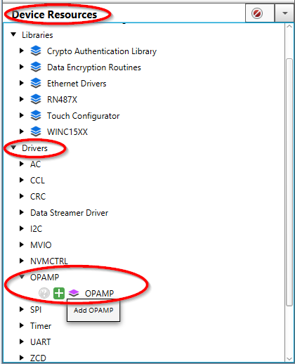

These System peripherals are added automatically: **CLKCTRL**, **Configuration Bits**, **Interrupt Manager** and **Pins**. 

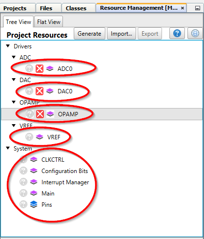

### System Configuration

The added peripherals will show up in the *Builder* window of **MCC** like shown below. Click on each peripheral block to get to each peripherals driver configuration **Easy View**.

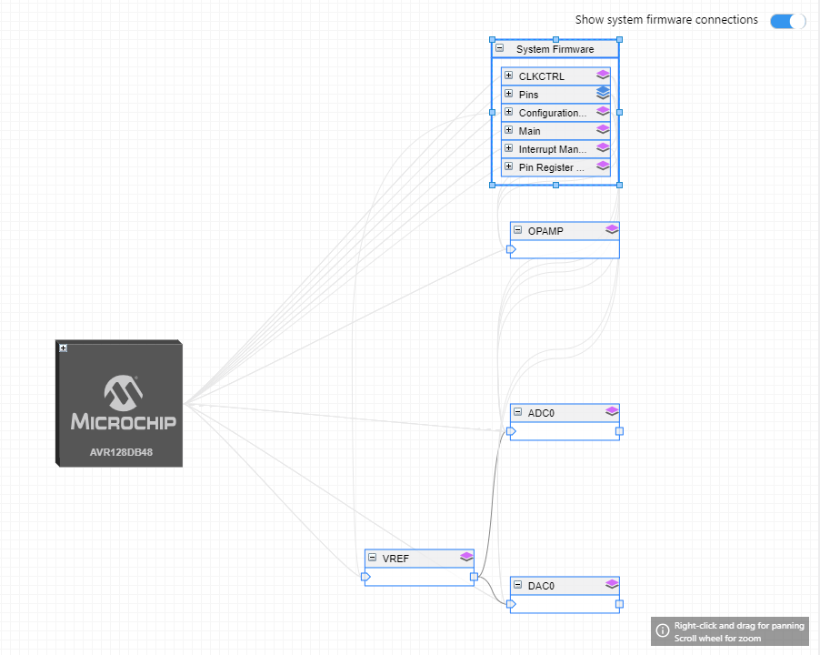

### System Configuration: CLKCTRL

The default clock configuration is used, no changes are needed. The **CLKCTRL** Easy View should look like the picture below.

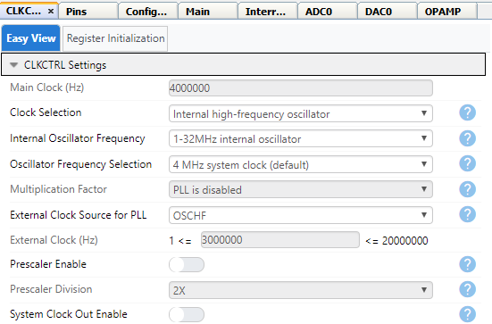

### System Configuration: Configuration Bits

The default configuration for **Configuration Bits** are used, and should look like this.

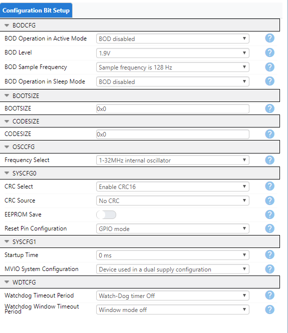

### System Configuration: Interrupt Manager

Use the default setup for **Interrupt Manager**, no interrupts are used in this example.

### System Configuration: PINS

The **PINS** configuration is made up of two boxes: the *Pins Grid View* and the *Pins* configuration box.
In the *Pins Grid View*, no changes are needed. The pins will be automatically highlighted green and show as "locked" during configuration. Note that the screen shot shows final PINS configuration, after all peripherals are configured. This will initially look different, before the OPAMP module is configured.

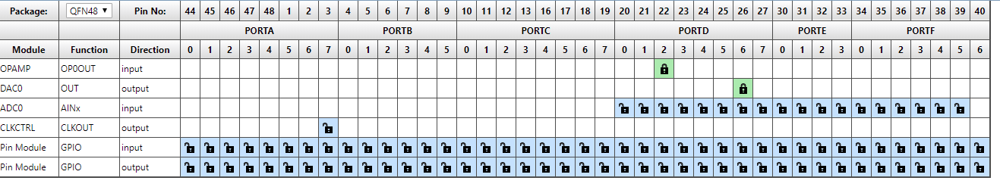

In the *Pins* configuration box, now the pins that are added will show in column *Pin Name* (PD2, PD6). In column *Custom Name* the example is using "OPAMP0_OUT" for PD2 and "DAC0_OUT" for PD6. Note also here that initially more pins will show up, and the screenshot shown is after all peripherals are configured.

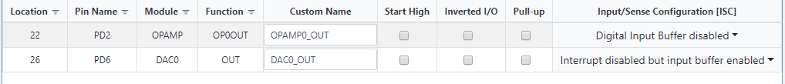

### VREF Configuration

Both the **DAC0** and **ADC0** peripherals are using the **VREF** peripheral.

- Enable the internal voltage reference for **ADC0** by turning on the "Enable Force ADC Voltage Reference" button
- Set the reference voltage source to "Internal 2.500V reference"
- Enable the internal voltage reference for **DAC0** by turning on the "Enable Force DAC Voltage Reference" button
- Set the reference voltage source to "Internal 2.500V reference"

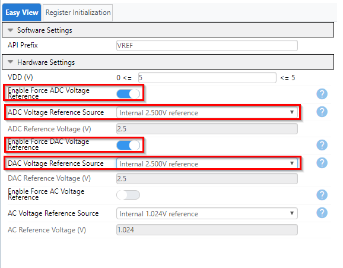

### ADC0 Configuration

- **ADC0** must be enabled by turning on the "Enable ADC" button
- Set Clock Pre-Scaler to "CLK_PER divided by 4", and Sample Length to "32"
- Turn off "Left Adjust Result" button

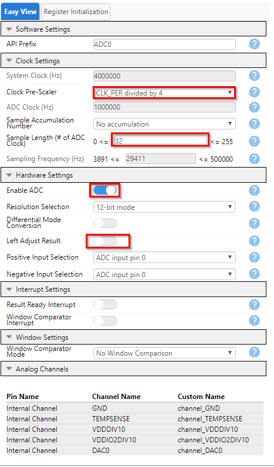

### DAC0 Configuration

- **DAC0** must be enabled by turning on the "Enable DAC" button
- The **DAC0** output must be enabled by turning on the "Enable Output on DAC" button

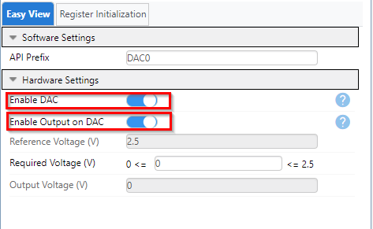

### OPAMP Configuration

- The **OPAMP** system must be enabled by turning on the "Enable OPAMP System" button
- Set the input range to "FULL"
- Select mode "SINGLE OPAMPs"
- Enable OP0 by turning on button "Enable OP0", and configure as "Non-Inverting Programmable Gain Amplifier"
- Disable OP1 and OP2 by turning off buttons "Enable OP1" and "Enable OP2"

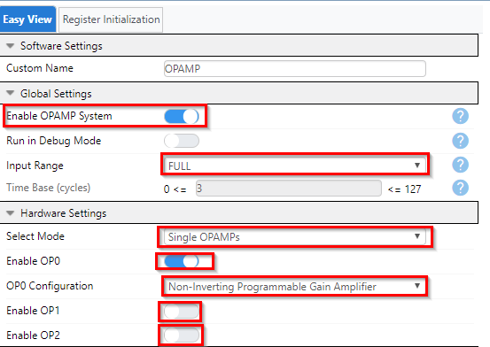

- Configure the Positive Input MUX to "DAC output" ("DAC" in data sheet)
- Set the Resistor Ladder Pair Wiper MUX to "R1 = 1R, R2 = 15R, R2/R1 = 15" ("WIP7" in data sheet)
- Enable the "Run in Standby Mode" button
- Set the Output Mode to "Output Driver in Normal Mode"
- Set Software Enable to "Always On"
- Set the Settle Time to 0 µs

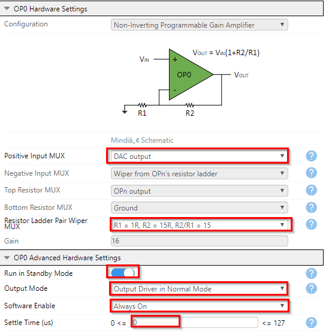

## Operation

- Download the zip archive or clone the example to get the source code
- Open `avr128db48-opamp-gain-and-offset-calibration-mplab-mcc.X` in MPLAB® X or MPLAB® Xpress IDE
- Set the project as Main project by right clicking the project name in the *Projects* window (Ctrl+1) and select *"Set as Main Project"* from the drop-down menu
- Program the project to the AVR128DB48 Curiosity Nano: 
	- First clean and build the project by pressing the *Clean and Build Main Project* button
	
	
	
	- Then make and program the project to the AVR128DB48 by clicking the *Make and Program Device Main Project* button
	
	
- If no tool has been selected, a window will open. Select the AVR128DB48 Curiosity Nano tool. The tool can also be selected in the project settings. 
- For details on the code, see inline comments in the .c files and the Appnote referenced in the *Related Documentation* section ([AN3633](https://microchip.com/DS00003633))
- To verify that the code is working as intended, insert a breakpoint on the last hyphen of the function `void PGA_Calibrate(void)` and press the *Debug Main Project* button

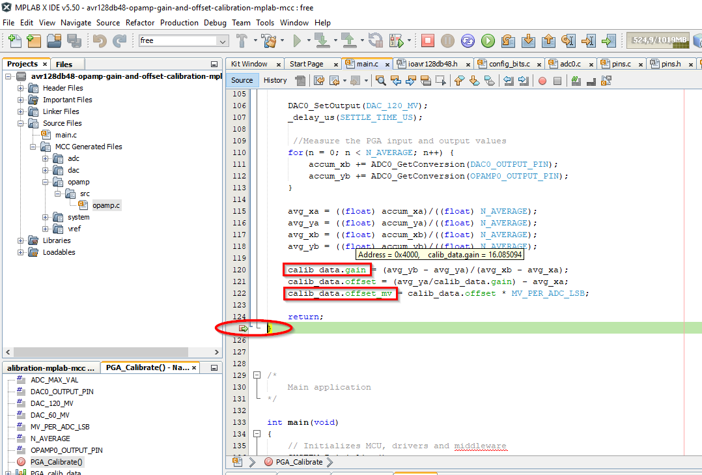

- When the brakpoint is triggered, you can hover the mouse pointer over the variables *calib_data.gain* (shown in screenshot) and *calib_data.offset_mv*. The value for gain should be somewhere around 16, and the value for offset should be in the region of some millivolts (positive as well as negative number). The numbers should be similar with small variations between consecutive measurements (debug runs).

## Summary
After going through this example, you should be able to calibrate the gain and offset of the OPAMP configured as a PGA. The calibrated gain and input offset values should be used by the application code for any calculations that involve gain and/or offset.
